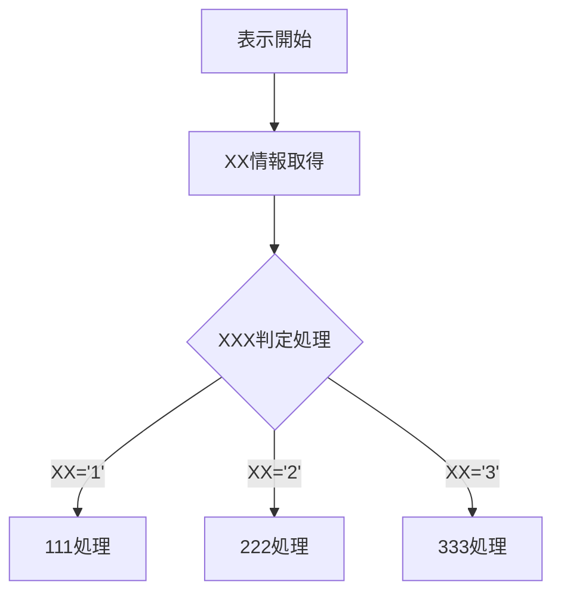

# ページ名 / 機能名 仕様書

## 1. 概要
- **背景**: このページ（または機能）を作成・改修する背景や目的を記載します。
- **目的**: この仕様書が対象とするスコープと、達成したいゴールを明確にします。
- **対象ユーザー**: 想定する利用者の属性や権限を記載します。
- **バージョン**: 20260927－01
---

## 2. 基本情報
<table>
  <tr>
    <th width="10%">項目</th>
    <th width="45%">内容</th>
    <th width="45%">補足</th>
  </tr>
  <tr>
    <td>URL</td>
    <td><a href="https://aaaaaaaaaaa.com/aaa">https://aaaaaaaaaaa.com/aaa</a></td>
    <td></td>
  </tr>
  <tr>
    <td>ページタイトル</td>
    <td></td>
    <td></td>
  </tr>
  <tr>
    <td>ディスクリプション</td>
    <td></td>
    <td></td>
  </tr>
  <tr>
    <td>GTMプロパティ</td>
    <td></td>
    <td></td>
  </tr>
</table>

---

## 3. 仕様概要
機能の全体像や、ユーザーがこのページでできることを簡潔に記載します。
* 主要機能A
* 主要機能B

---

## 4. 画面・UI仕様
画面のレイアウトや、UIコンポーネントごとの挙動を定義します。

<table>
  <tr>
    <th width="5%">№</th>
    <th width="10%">要素名</th>
    <th width="20%">デザインパターン</th>
    <th width="65%">説明</th>
  </tr>
  <tr>
    <td>1</td>
    <td>ログインボタン</td>
    <td><a href="">10-001A</a></td>
    <td>ボタン押下で共通ログインページへ遷移</td>
  </tr>
  <tr>
    <td>1</td>
    <td>ログアウトボタン</td>
    <td><a href="">10-001B</a></td>
    <td>ボタン押下で共通ログアウトページへ遷移</td>
  </tr>
</table>

---

## 5. 処理フロー
システムの処理の流れやデータ受け渡しをMermaid形式で表現します。

---

## 6. データ・API仕様
### 6-1. データ
| 分類 | 変数名 | 説明 |
| :--- | :--- | :--- |
| グローバル変数 | G_AUTH | 1：未認証 2：認証済み  |
| Cookie | cokkie_auth |  1：未認証 2：認証済み  |
| LocalStorage | LS_auth |  1：未認証 2：認証済み  |

### 6-2. API
| API名 | エンドポイント | 説明 |
| :--- | :--- | :--- |
| <a href="">認証状態取得API</a> | https://****/auth | 認証状態を取得する為のAPI |
| XXXXX | XXXXX | XXXX |
| XXXXX | XXXXX | XXXX |

## 7. 処理詳細
### 7-1. XX処理
XXXXXXX

### 7-2. XX処理
XXXXXXX